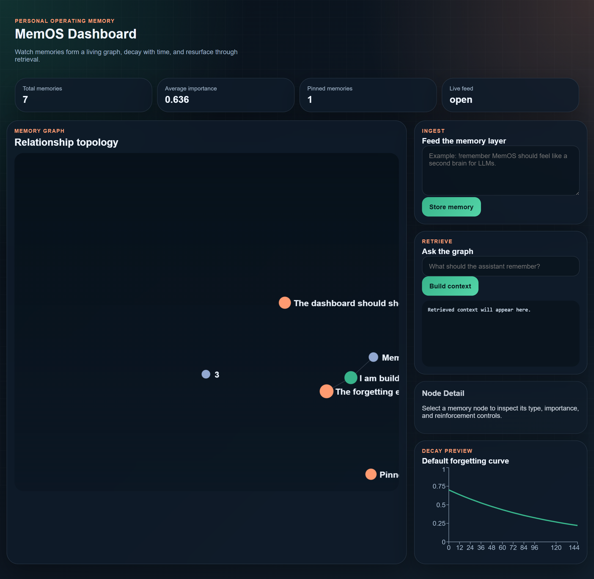
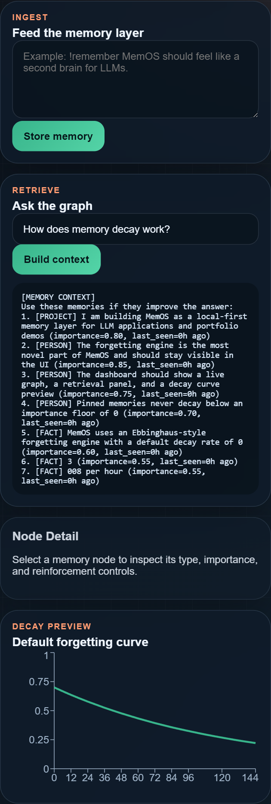

# MemOS

MemOS is a local-first memory layer for LLM applications. Instead of treating memory as static document retrieval, it stores extracted facts as living nodes in a graph, ranks them with recency-aware retrieval, and lets them decay over time unless they are reinforced.

It is designed to feel like a persistent operating memory for assistants: a system that remembers what matters, forgets what no longer matters, and makes those decisions visible.

## Why it is interesting

- It combines structured memory extraction, graph storage, vector retrieval, and a forgetting engine in one project.
- It stays usable in local development even without Anthropic, ChromaDB, or sentence-transformers thanks to built-in fallbacks.
- It ships with a live React dashboard so the memory layer is inspectable, not invisible infrastructure.

## Screenshots





## What is included

- Python package with memory models, scoring, extraction, decay logic, retrieval ranking, and FastAPI routes
- Local-first persistence through a NetworkX graph plus a vector layer with ChromaDB support and JSON fallback
- React dashboard with live graph updates, reinforcement controls, and a decay curve preview
- Tests for decay math, extraction, and end-to-end retrieval
- Evaluation artifacts for retrieval quality and decay behavior over time

## Project structure

```text
memos/
├── memos/
│   ├── core/
│   ├── retrieval/
│   └── api/
├── dashboard/
├── docs/
├── evaluation/
├── scripts/
└── tests/
```

## Quickstart

### Backend

```powershell
python -m venv .venv
.venv\Scripts\Activate.ps1
pip install -r requirements.txt
copy .env.example .env
uvicorn memos.api.main:app --reload --port 8000
```

Optional:

- Set `ANTHROPIC_API_KEY` to enable Claude-based extraction.
- Install the `vector` optional dependencies if you want ChromaDB and sentence-transformers instead of the lightweight fallback.

### Frontend

```powershell
cd dashboard
npm install
npm run dev
```

The dashboard expects the API at `http://localhost:8000`.

## Memorable example conversation

```text
User: I am building MemOS as a local-first memory layer for LLMs.
User: !remember The forgetting engine is the most novel part and should stay visible in the UI.
User: The dashboard should show a live graph, a retrieval panel, and a decay preview.

Later:
User: What should the assistant remember about this project?

MemOS retrieval context:
1. [PROJECT] I am building MemOS as a local-first memory layer for LLMs
2. [PREFERENCE] The forgetting engine is the most novel part and should stay visible in the UI
3. [FACT] The dashboard should show a live graph, a retrieval panel, and a decay preview
```

Longer write-up: [docs/example-conversation.md](docs/example-conversation.md)

## Evaluation

The repo now includes lightweight evaluation artifacts that make the system behavior inspectable:

- Retrieval walkthroughs in [evaluation/retrieval_examples.json](evaluation/retrieval_examples.json)
- Decay projections in [evaluation/decay_projection.csv](evaluation/decay_projection.csv)
- A human-readable summary in [docs/evaluation.md](docs/evaluation.md)


## API endpoints

- `POST /memory/ingest`
- `POST /memory/query`
- `GET /memory/graph`
- `GET /memory/stats`
- `GET /memory/export`
- `POST /memory/{node_id}/reinforce`
- `DELETE /memory/{node_id}`
- `GET /memory/events`

## Development notes

- `scripts/generate_eval_artifacts.py` regenerates the retrieval and decay artifacts used in the docs.
- `dashboard` can be built with `npm run build`.
- `pytest` covers the core decay and retrieval path.

## License

This project is released under the MIT License. See [LICENSE](LICENSE).
