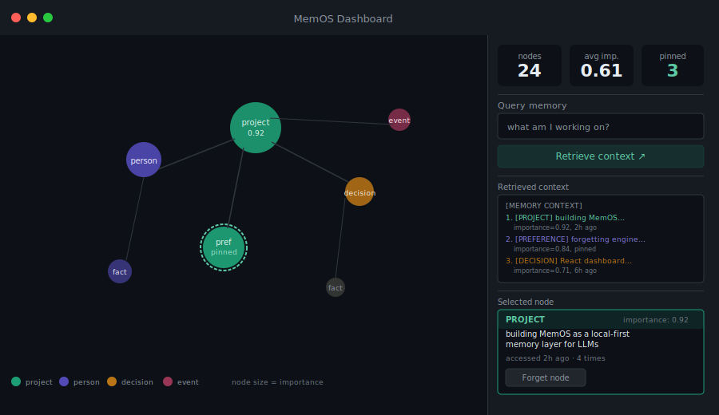
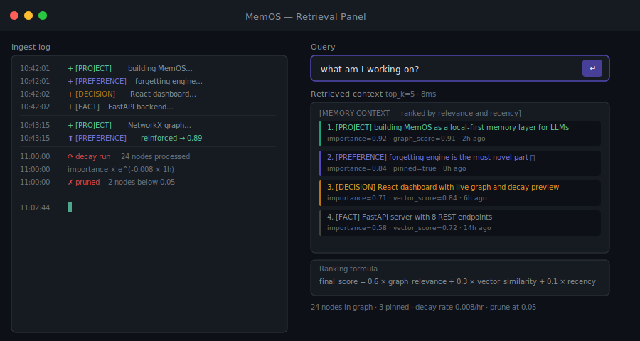
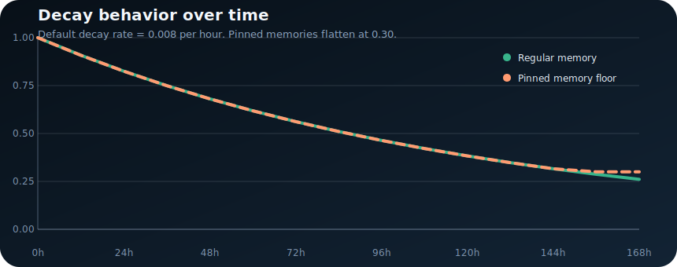

# MemOS


**A local-first memory layer for LLM applications.**

LLMs forget everything between sessions. MemOS fixes that — not by dumping raw chat history into context, but by extracting facts into a living graph, scoring them by importance, and letting unimportant memories fade over time using the Ebbinghaus forgetting curve. What stays is what matters.

```
User: I'm building MemOS as a local-first memory layer for LLMs.
User: !remember The forgetting engine is the most novel part.
User: The dashboard should show a live graph and a decay preview.

--- 3 days later ---

User: What do you remember about this project?

MemOS injects:
1. [PROJECT]    building MemOS as a local-first memory layer   importance=0.84
2. [PREFERENCE] forgetting engine is the most novel part       importance=0.81  pinned
3. [FACT]       dashboard: live graph + decay preview          importance=0.61
```

---

## Dashboard



The memory graph renders live — node size encodes importance, colours encode entity type, and the panel on the right lets you query, inspect, and forget individual nodes.



---

## How it works

```
User message
     │
     ├──► Extractor (Claude Haiku)  →  entities + importance scores
     │              │
     │     ┌────────┴──────────────┐
     │     │  Entity Graph         │  NetworkX — nodes, edges, relations
     │     │  Vector Store         │  ChromaDB — semantic embeddings
     │     └────────┬──────────────┘
     │              │  hourly: importance × e^(−rate × hours)
     │
     └──► Query → graph traversal + vector search → ranked context → LLM
```

Three things happen on every message:

**Write path** — the extractor pulls entities from the message, the scorer assigns importance 0–1, and both the graph and vector store are updated.

**Decay engine** — runs hourly via APScheduler. Every node's importance decays exponentially (`rate=0.008`, half-life ≈ 87 hours). Nodes below the prune threshold (0.05) are deleted. Pinned nodes (`!remember`) never drop below 0.30.

**Read path** — on each query, graph traversal and vector similarity results are merged and scored: `0.6 × graph_relevance + 0.3 × vector_similarity + 0.1 × recency`. The top-k results are injected as a system prompt prefix.

### Decay behaviour



---

## Quickstart

### Backend

**Windows**
```cmd
python -m venv .venv
.venv\Scripts\Activate.ps1
pip install -r requirements.txt
copy .env.example .env
uvicorn memos.api.main:app --reload --port 8000
```

**Mac / Linux**
```bash
python -m venv .venv
source .venv/bin/activate
pip install -r requirements.txt
cp .env.example .env
uvicorn memos.api.main:app --reload --port 8000
```

Then open `http://localhost:8000/docs` for the interactive API explorer.

**Optional extras**
```bash
pip install "memos-ai[llm]"        # Claude-based extraction
pip install "memos-ai[vector]"     # ChromaDB + sentence-transformers
pip install "memos-ai[all]"        # everything
```

Without these extras MemOS runs with a lightweight keyword extractor and an in-memory JSON fallback — useful for local dev and CI with no API keys.

### Frontend

```bash
cd dashboard
npm install
npm run dev
# http://localhost:5173
```

### Quick test

```bash
# Ingest a message
curl -X POST http://localhost:8000/memory/ingest \
  -H "Content-Type: application/json" \
  -d "{\"message\": \"I am building a memory system for LLMs called MemOS\"}"

# Query
curl -X POST http://localhost:8000/memory/query \
  -H "Content-Type: application/json" \
  -d "{\"query\": \"what am I working on?\", \"top_k\": 5}"

# Graph JSON (for dashboard)
curl http://localhost:8000/memory/graph

# Stats
curl http://localhost:8000/memory/stats
```

---

## API reference

| Method | Endpoint | Description |
|--------|----------|-------------|
| `POST` | `/memory/ingest` | Extract entities from a message and store them |
| `POST` | `/memory/query` | Return ranked context string for a query |
| `GET` | `/memory/graph` | D3-compatible node-link JSON for the dashboard |
| `GET` | `/memory/stats` | Node count, avg importance, pinned count |
| `GET` | `/memory/export` | Full graph export as JSON |
| `POST` | `/memory/{id}/reinforce` | Boost a node's importance and pin it |
| `DELETE` | `/memory/{id}` | Forget a specific memory node |
| `GET` | `/memory/events` | SSE stream for live dashboard updates |

Full OpenAPI docs at `http://localhost:8000/docs`.

---

## Project structure

```
memos/
├── memos/
│   ├── core/
│   │   ├── models.py        MemoryNode dataclass
│   │   ├── extractor.py     LLM entity extraction
│   │   ├── scorer.py        Importance scoring
│   │   ├── decay.py         Ebbinghaus decay engine
│   │   └── store.py         ChromaDB + NetworkX manager
│   ├── retrieval/
│   │   ├── graph_query.py   Graph traversal
│   │   ├── vector_query.py  ChromaDB search
│   │   └── injector.py      Context merging + ranking
│   └── api/
│       ├── main.py          FastAPI app + scheduler
│       ├── routes.py        Endpoint handlers
│       └── schemas.py       Pydantic models
├── dashboard/               React + react-force-graph-2d
├── docs/                    Assets and evaluation write-ups
├── evaluation/              Retrieval examples + decay CSV
├── scripts/                 Artifact generation
└── tests/                   pytest suite
```

---

## What is included

| Component | Description |
|-----------|-------------|
| `memos/core/` | `MemoryNode` dataclass, extractor, scorer, decay engine, store |
| `memos/retrieval/` | Graph traversal, vector query, context injector |
| `memos/api/` | FastAPI routes, Pydantic schemas, SSE events stream |
| `dashboard/` | React + react-force-graph-2d live memory graph |
| `evaluation/` | Retrieval walkthroughs + decay projection CSV + SVG chart |
| `tests/` | Decay math, extraction, end-to-end retrieval |

---

## Tech stack

| Layer | Choice |
|-------|--------|
| Entity extraction | `anthropic` (claude-haiku) — fast, structured JSON |
| Embeddings | `sentence-transformers/all-MiniLM-L6-v2` — local, no API cost |
| Vector store | `chromadb` — local-first, cosine similarity |
| Graph engine | `networkx` — zero infra, JSON-serialisable |
| Decay scheduler | `apscheduler` — background thread, no Redis |
| API | `fastapi` + `uvicorn` — async, auto OpenAPI docs |
| Dashboard | `react` + `react-force-graph-2d` — live graph viz |

---

## Evaluation

The `evaluation/` folder makes the system's behaviour inspectable:

- [`evaluation/retrieval_examples.json`](evaluation/retrieval_examples.json) — concrete retrieval walkthroughs
- [`evaluation/decay_projection.csv`](evaluation/decay_projection.csv) — hour-by-hour importance scores
- [`docs/evaluation.md`](docs/evaluation.md) — human-readable summary

To regenerate after code changes:
```bash
python scripts/generate_eval_artifacts.py
```

---

## License

MIT — see [LICENSE](LICENSE).
